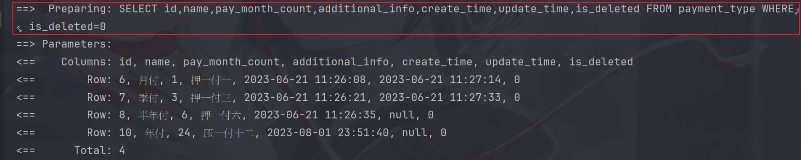
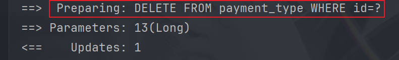
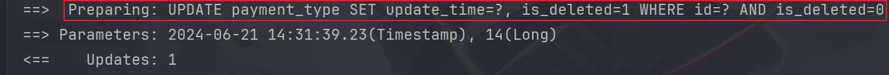
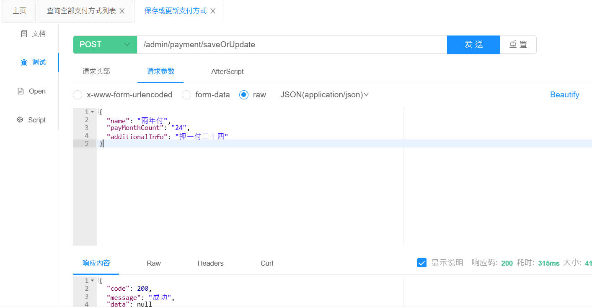
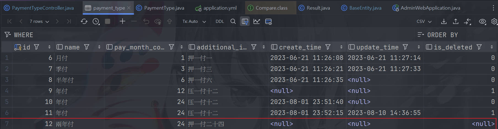
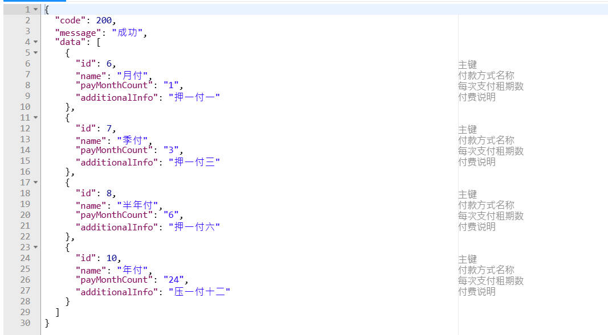
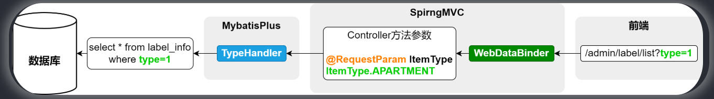
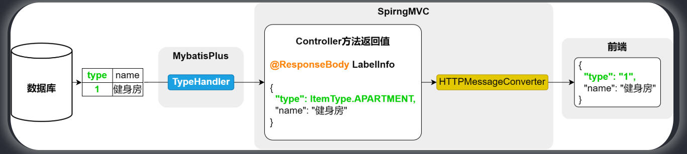
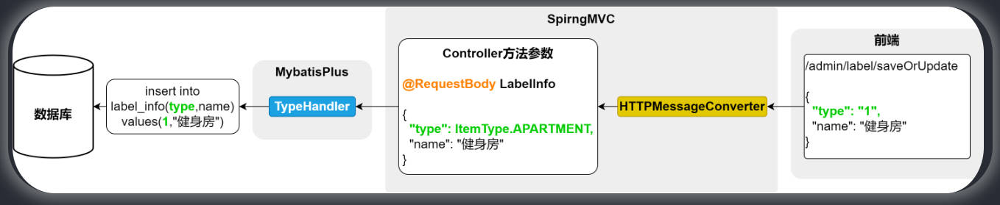
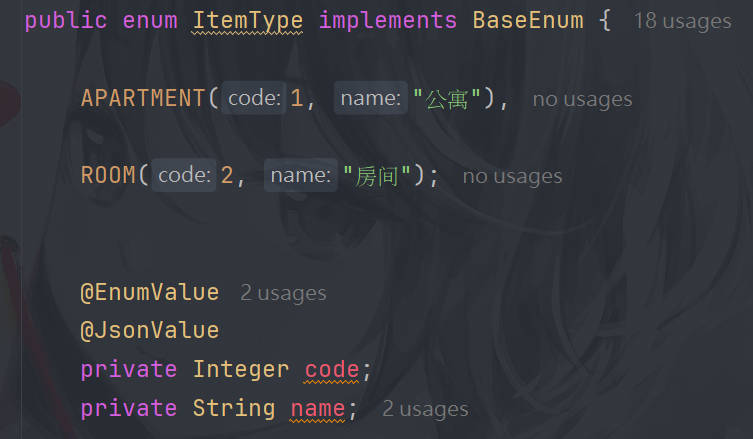

# 項目目的

- 1. 學習一些 JAVA 的開發技巧。
- 2. 想知道 redis 實際上會應用在什麼場景。

對於此項目的初始化步驟這裡不做筆記，直接看影片教學文檔即可。

影片中的所有操作還是會跟者做同步到 git，但並不會全部東西都記錄到筆記

## BaseEntity

module:model

package:com.atguigu.lease.model.entity

項目中將 entity 的常用字段(id`、`create_time`、`update_time`、`is_deleted`)給抽取到了一個 class BaseEntity，並且讓其他 entity 去 extends BaseEntity。

優點:方便管理，假設今天要對 `is_deleted` 這個屬性加上一些 annotation，那只要在 BaseEntity 加上即可。

## 資料庫的狀態字段在 JAVA 中使用 enums

對於資料庫中的狀態字段，通常是儲存一個 int，而非直接儲存字串，譬如訂單狀態，在資料庫中並不會直接存者「待支付、待發貨、待收貨」等等，而是存者「1、2、3 ...」去表示訂單的狀態，但如果在 JAVA 中也用 INT 去寫程式碼的話，那可讀性很差 ，譬如:

```java
order.setStatus(1);
if (order.getStatus() == 1) {
order.setStatus(2);
}
```

上述這種程式碼的可讀性很差，此時可以使用 enums。

```java
public enum Status {

CANCEL(0, "已取消"),
WAIT_PAY(1, "待支付"),
WAIT_TRANSFER(2, "待发货"),
WAIT_RECEIPT(3, "待收货"),
RECEIVE(4, "已收货"),
COMPLETE(5, "已完结");

private final Integer value;
private final String desc;

public Integer value() {
  return value;
}
public String desc() {
  return desc;
}
}
```

```java
@Data
public class Order{
 // 省略其他字段 ...
 private Status status;
 ...
}
```

這樣程式碼就會變成如下，可讀性就會上升。

```java
order.setStatus(Status.WAIT_PAY);
```

## 將 entity 序列化

可以看到項目中的 `BaseEntity implements Serializable`，教學是說如果想將某個 obj 放到緩存(如 redis)，那就得 `implements Serializable`。

## MyBatis-Plus 提供的邏輯刪除功能

因為此項目都是邏輯刪除，而假設今天想查詢資料庫中的資料，譬如查詢全部的支付方式，那當然是只能查詢 `is_deleted = 0`的資料，因此實作方式就會變為:

```java
    // api url:/admin/payment/list
    @GetMapping("list")
    public Result<List<PaymentType>> listPaymentType() {
        LambdaQueryWrapper<PaymentType> lambdaQueryWrapper = new LambdaQueryWrapper();
        lambdaQueryWrapper.eq(PaymentType::getIsDeleted, 0);
        List<PaymentType> paymentTypeList = paymentTypeService.list(lambdaQueryWrapper);
        return Result.ok(paymentTypeList);
    }
```

但如果用上述這種方式，那就得每個查詢都要自己加上QueryWrapper，工作量不小，因此 MyBatis-Plus 提供了一種邏輯刪除功能，可以自動的為 sql 語句添加 `is_deleted = 0`的 where 過濾語句。

### MyBatis-Plus 邏輯刪除功能步驟

#### Step.1

此步驟有兩種實現方式

##### 方式1

在`application.yml`新增以下內容

```yml
mybatis-plus:
  global-config:
    db-config:
      logic-delete-field: flag # 指定要用來判斷邏輯刪除的實體類字段名，小心不是資料庫的字段名，而是映射的 java entity 屬性名
```

##### 方式2

使用 annotation `@TableLogic`

```java
    @TableLogic
    @TableField("is_deleted")
    private Byte isDeleted;
```

#### step.2

在 `application.yml`配置邏輯刪除的判斷值

```yml
mybatis-plus:
  global-config:
    db-config:
      logic-delete-value: 1 # 邏輯已刪除值(默認值為 1)
      logic-not-delete-value: 0 # 邏輯未刪除值(默認值為 2)
```

#### result

可以看到 sql 語句自訂加上了 where is_deleted = 0 的判斷



### 邏輯刪除對通用 Service、Mapper 的影響

當配置邏輯刪除後，由 MyBatis-Plus 所提供的通用 Service、Mapper 將不具備真正的 Delete sql 功能，而是全部變成由 Update sql 所代替的邏輯刪除。

當執行以下 API 時會根據邏輯刪除的配置有者不同的 SQL 語句

```java
    @Operation(summary = "根据ID删除支付方式")
    @DeleteMapping("deleteById")
    public Result deletePaymentById(@RequestParam Long id) {
        paymentTypeService.removeById(id);
        return Result.ok();
    }
```

#### 未配置邏輯刪除時的`removeById(id)`

此時實際執行的是 DELETE SQL



#### 配置邏輯刪除時的`removeById(id)`

此時實際執行的是 UPDATE SQL，而非 DELETE SQL。



## 對`create_time、update_time`增加自動填充功能

### 場景

發生於項目中實作「保存或更新支付方式」api 時。

```java
package com.atguigu.lease.web.admin.controller.apartment;
    @Operation(summary = "保存或更新支付方式")
    @PostMapping("saveOrUpdate")
    public Result saveOrUpdatePaymentType(@RequestBody PaymentType paymentType) {
        paymentTypeService.saveOrUpdate(paymentType);
        return Result.ok();
    }
```

此時透過 knife4j 發送 api



可以看到是 200 成功，並且也確實寫入了資料庫



但若透過 GET /admin/payment/list 卻查不到此筆資料



原因是因為 `is_deleted`為 null，因此查詢不出來，而解決`is_deleted`的方式很簡單，直接在 mysql 指定`is_deleted`的 default value 為 0 即可，但對於`create_time、update_time`就不可這樣了，雖然可以透過在 java 裡使用`setCreateTime(System.CurrentTime)`等方式去解決，但這樣一來勢必要在每個 api 都去添加此程式碼，非常的繁瑣，因此 MyBatis_Plus 提供了一種自動填充某個字段的功能。

### MyBatis-Plus 配置自動填充字段功能

自動填充功能就是透過一些配置，使得在插入、更新數據時，能自動地為指定的字段賦值

#### step.1

首先需要為要自動配置的字段指定要填充的時機

透過`@TabledField(fill)`去指定觸發自動填充的時機

```java
    @Schema(description = "创建时间")
    @TableField(value = "create_time", fill = FieldFill.INSERT)
    @JsonIgnore
    private Date createTime;

    @Schema(description = "更新时间")
    @TableField(value = "update_time", fill = FieldFill.UPDATE)
    @JsonIgnore
    private Date updateTime;
```

#### step.2

此步驟要配置的是填充的內容

此程式碼位於 module:common、package:com.atguigu.lease.common.mybatisplus

```java
@Component
public class MybatisMetaObjectHandler implements MetaObjectHandler {
    @Override
    public void insertFill(MetaObject metaObject) {
        this.strictInsertFill(metaObject, "createTime", Date.class, new Date());
    }

    @Override
    public void updateFill(MetaObject metaObject) {
        this.strictUpdateFill(metaObject, "updateTime", Date.class, new Date());
    }
}
```

## 前後端的數據類型轉換流程

### 發生問題場景

問題發生於實作`LabelController`的 /list API 時

```java
    @Operation(summary = "（根据类型）查询标签列表")
    @GetMapping("list")
    public Result<List<LabelInfo>> labelList(@RequestParam(required = false) ItemType type) {
        LambdaQueryWrapper<LabelInfo> wrapper = new LambdaQueryWrapper<>();
        wrapper.eq(type != null, LabelInfo::getType, type);
        List<LabelInfo> list = service.list(wrapper);
        return Result.ok(list);
    }
```

當調用此 API 時會得到 status 400，並且出現以下錯誤訊息

```shell
2024-06-21T16:03:40.880+08:00  WARN 3584 --- [nio-8081-exec-3] .w.s.m.s.DefaultHandlerExceptionResolver : Resolved [org.springframework.web.method.annotation.MethodArgumentTypeMismatchException: Failed to convert value of type 'java.lang.String' to required type 'com.atguigu.lease.model.enums.ItemType'; Failed to convert from type [java.lang.String] to type [@org.springframework.web.bind.annotation.RequestParam com.atguigu.lease.model.enums.ItemType] for value '1']
```

分析此錯誤訊息之前，要先了解一下前端-後端-資料庫之間的數據類型轉換流程

### 前端發送 http request

首先，SpringMVC的`WebDataBinder`會將 http req parameter 綁定到 controller 方法上的參數，並且進行數據類型上的轉換，舉例來說就是將 `type` 從 `String` 轉換成 `ItemType`。

而在資料庫中，`type`實際上是以`INT`的方式儲存的，但在 java 中，`LabelInfo Table`所對應的 Entity 的 `type` 是一個`ItemType`的數據類型，因此，若要將此 Entity 的數據給寫回資料庫，得在做一次數據類型轉換，而這是由 Mybatis-Plus 的`TypeHandler`實現的，`TypeHandler`就是用來處理 java Entity 與資料庫之間的數據類型轉換。



### 後端響應 response 給前端

同理，資料庫的數據映射到 java 變成一個 Entity 時，數據類型的轉換是由`TypeHandler`完成的，而 Controller 在響應 response 給前端時，也就是將一個 java 物件轉換成 http responsebody 中的 json 字串，而這是由`HTTPMessageConverter`完成的。



#### `HTTPMessageConverter` 功能

`HTTPMessageConverter`會負責將帶有`@ResponseBody`的方法的返回值(java 物件)轉換成 http responsebody 中的 json 字串。

也用來將 requestbody 中的 json 字串轉換到 Controller 中帶有`@RequestBody`的方法參數上(java 物件)。



### `WebDataBinder`的類型轉換機制

`WebDataBinder`在將前端的參數綁定到 Controller 方法上聲明的`@RequestParam`參數時，若`@RequestParam`參數的類型不是 String，則會自動的進行數據類型轉換，而`WebDataBinder`在實現數據類型轉換時，實際上是依賴於`Converter`在實現的，spring MVC 提供了各種常用類型的 `Converter`，像是 String &rarr; Integer、String &rarr; Date 等等，而其中也提供了 String &rarr; Enums 的轉換，但是提供的是根據 Enums物件名("APARTMENT") &rarr; ItemType.APARTMENT 這種方式，若想要根據 code 屬性 &rarr; Enums.Obj 的話，那需要自定義 Converter。

[Converter 官方文檔](https://docs.spring.io/spring-framework/reference/core/validation/convert.html#core-convert-Converter-API)

#### 自定義 `Converter` 步驟

##### Step.1 自定義 `Converter`

```java
package com.atguigu.lease.web.admin.custom.converter;
@Component
public class StringToItemTypeConverter implements Converter<String, ItemType> {
    @Override
    public ItemType convert(String code) {
        ItemType[] values = ItemType.values();
        for (ItemType itemType : values) {
            if (itemType.getCode().equals(Integer.valueOf(code))) {
                return itemType;
            }
        }
        throw new IllegalArgumentException("code:" + code + "非法");
    }
}
```

##### Step.2 註冊 `Converter`

```java
package com.atguigu.lease.web.admin.custom.config;
@Configuration
public class WebMvcConfiguration implements WebMvcConfigurer {

    @Autowired
    private StringToItemTypeConverter stringToItemTypeConverter;

    @Override
    public void addFormatters(FormatterRegistry registry) {
        registry.addConverter(this.stringToItemTypeConverter);
    }
}
```

#### 自定義 `ConverterFactory`

先前自定義`Converter`的方式，若是有多個轉換邏輯相同(都是 code &rarr; enums)，那就需要為每個 enums 都實作一個 Coverter，很不方便，因此這裡介紹另一種實現的方式。

首先，`ConverterFactory`可以將同一套轉換邏輯，應用到一個 interface 的所有實現類。

##### step.1 定義 interface `BaseEnum`

讓所有 enums 都實現這個 interface。

```java
public interface BaseEnum {
    Integer getCode();
    String getName();
}
```

##### step.2 實作`ConverterFactory`

```java
@Component
public class StringToBaseEnumConverterFactory implements ConverterFactory<String, BaseEnum> {
    @Override
    public <T extends BaseEnum> Converter<String, T> getConverter(Class<T> targetType) {
        return new Converter<String, T>() {
            @Override
            public T convert(String source) {

                for (T enumConstant : targetType.getEnumConstants()) {
                    if (enumConstant.getCode().equals(Integer.valueOf(source))) {
                        return enumConstant;
                    }
                }
                throw new IllegalArgumentException("非法的枚舉值:" + source);
            }
        };
    }
}
```

##### step.3 註冊`ConverterFactory`

一樣在`WebConfigurer`註冊

```java
package com.atguigu.lease.web.admin.custom.config;
    @Override
    public void addFormatters(FormatterRegistry registry) {
        registry.addConverterFactory(stringToBaseEnumConverterFactory);
    }
```

### `TypeHandler`的枚舉類型轉換

MyBatis 提供的`TypeHandler`也能處理大部分的類型轉換需求，譬如 String、Integer、Date 等等，其中也包含了 enums，而 enums 的默認轉換規則，也是 枚舉物件實例(ItemType.APARTMENT) &lrarr; 物件名稱("APARTMENT")，若是想改成 code屬性 &lrarr; ItemType.APARTMENT 的形式，在 MyBatis 中需要自定義 `TypeHandler`，而在MyBatis-Plus 則提供了一個`@EnumValue`的快速使用方式。

#### 展示

只要在 `code` 屬性上添增`@EnumValue`，即可讓`APARTMENT`、`ROOM`等 Enum 實例映射到`code`屬性上。



### `HTTPMessageConverter`的枚舉類型轉換

`HTTPMessageConverter`在將 obj 轉換成一個 json 格式時(`@ResponseBody`)，對於 enums 默認也是使用枚舉物件實例(ItemType.APARTMENT) &rarr; 枚舉物件名稱("APARTMENT")的方式，而若想實現枚舉物件實例(ItemType.APARTMENT) &rarr; code 屬性的話，也只需要在`code`添加一個`@JsonValue`即可。

同理，從 json 轉換成 obj 時也是這樣(`@RequestBody`)。


